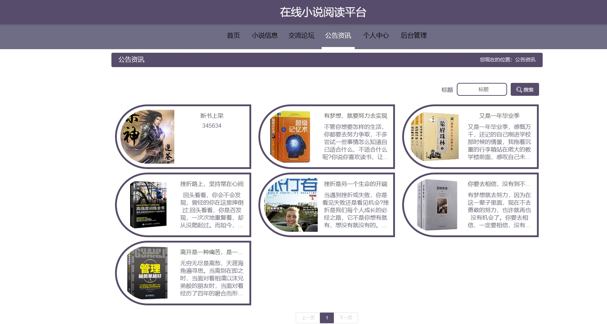
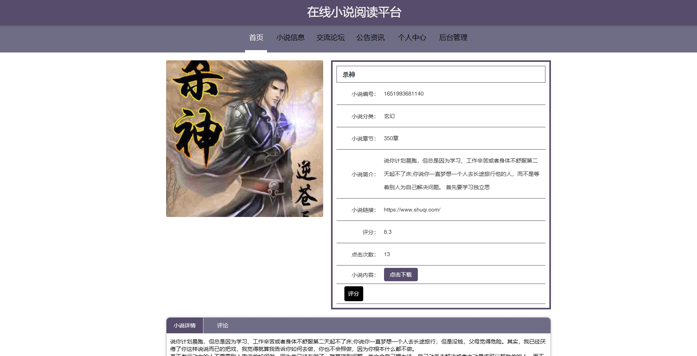
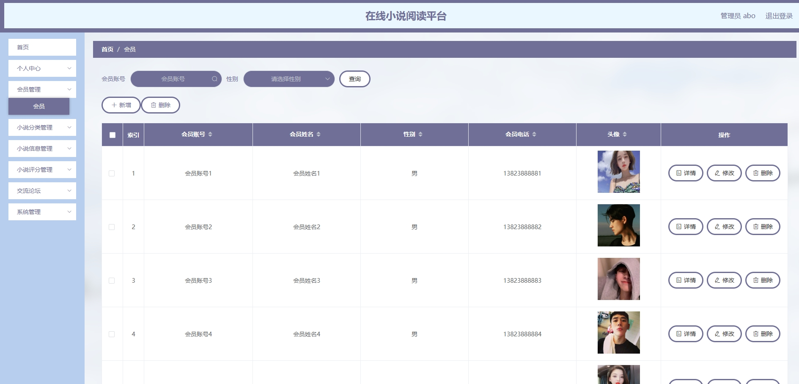
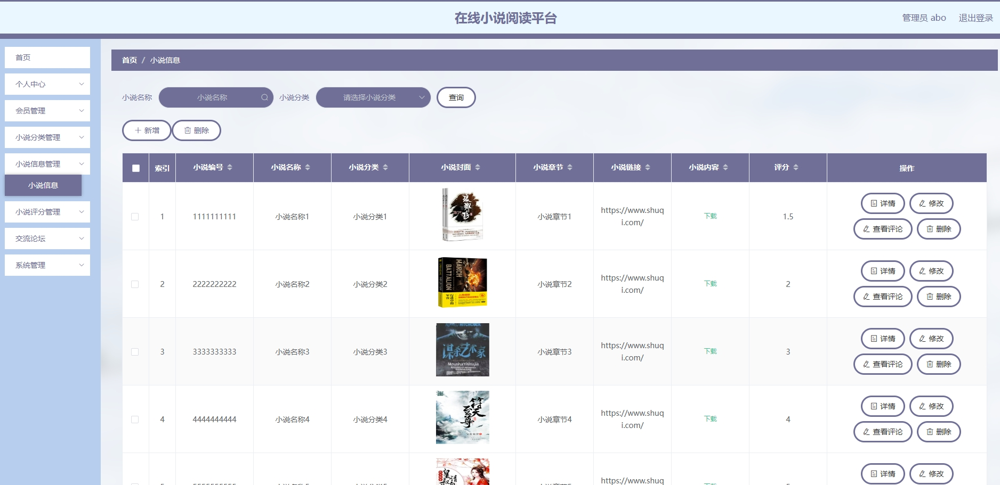
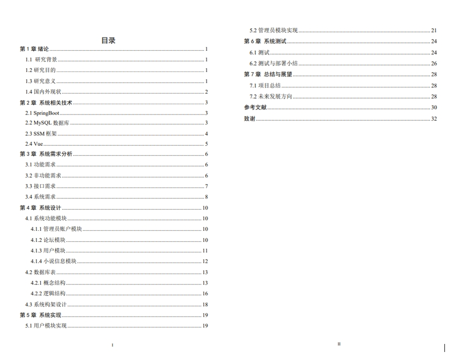
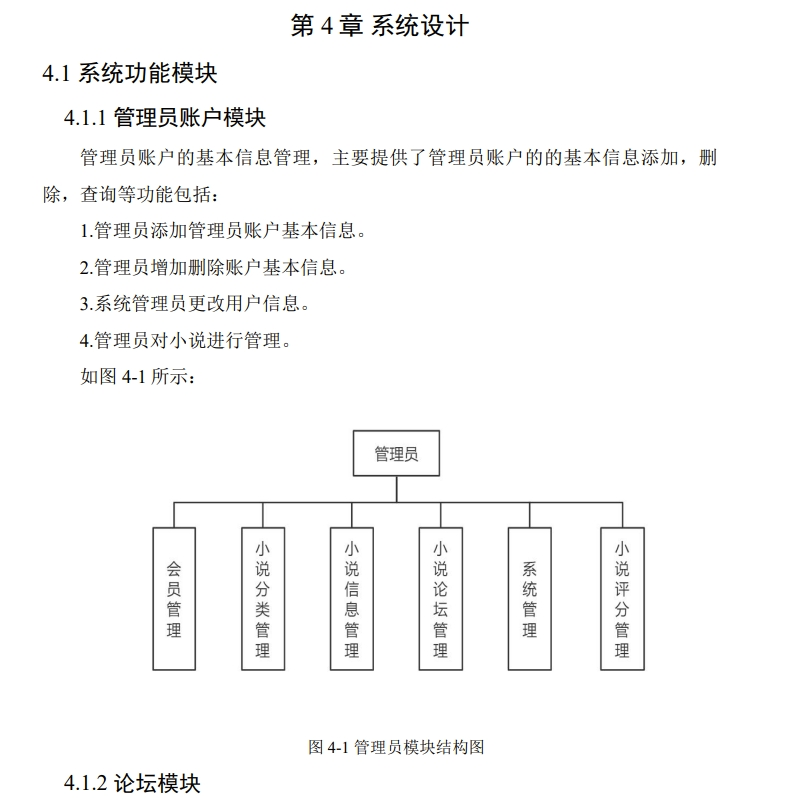
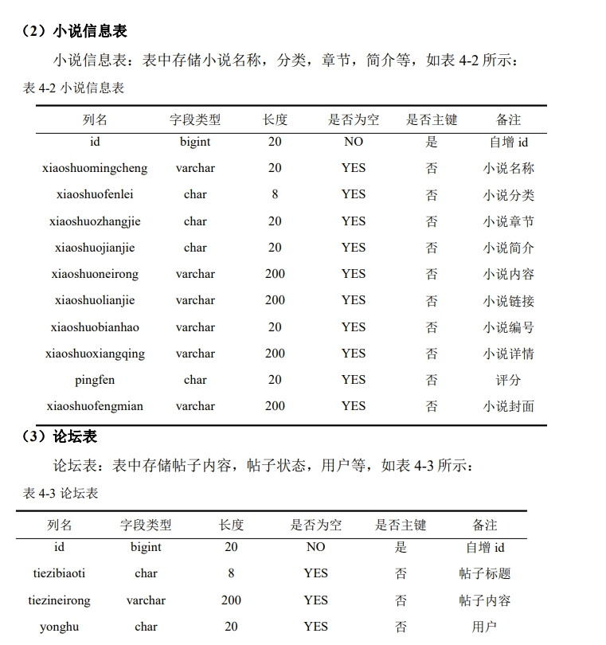

# 基于SpringBoot的小说阅读下载网站,

# 1.介绍
- 我的测试环境：IDEA2022，Mysql5.7
- 技术栈：SpringBoot, Vue（后端管理web提供的是dist包），LayUI（门户）
- 角色：管理员，会员

# 2.安装教程

① 导入数据库(使用navicat或者其他工具，我的数据库编码是utf8mb4，排序默认）
② 按照你的数据库环境，修改代码
③ 启动项目
# 3.项目部分截图

# 4.获取方式
获取方式：[戳我查看](https://gitee.com/aven999/mall)💕